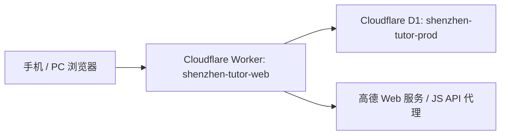

# 运行与部署

## 当前正式架构

正式站不是 Node 单实例或 `db.json` 部署。当前生产结构为：



- 正式域名：<https://tutor.liuzonghao.top>
- GitHub：<https://github.com/lzhdelife/shenzhen-tutor-web>
- 稳定分支：`main`
- Worker 配置：`wrangler.jsonc`
- D1 migration：`cloudflare/migrations/`

Worker 同时提供静态页面、API、鉴权、高德同源代理和定时清理。正式业务数据持久化在 D1，不在仓库或 Worker 文件系统中。

## 本地运行

```powershell
npm.cmd install
npm.cmd start
```

默认地址为 <http://127.0.0.1:8787>。本地 Node 服务使用 `TutorPlatform/data/db.json` 或 `TUTOR_DATA_DIR` 指定目录，只用于开发和回归测试；不要用本地 JSON 覆盖或替代正式 D1。

## 密钥配置

高德三项真实配置只保存在 Cloudflare Worker Secret 和被 Git 忽略的本地配置中：

- `AMAP_WEB_SERVICE_KEY`
- `AMAP_JS_API_KEY`
- `AMAP_JS_SECURITY_CODE`
- `AUTH_PEPPER`

本地高德配置可运行：

```powershell
powershell -ExecutionPolicy Bypass -File .\scripts\configure-amap-local.ps1
```

禁止把真实 Key、管理员凭证、Token 或生产数据写入 `wrangler.jsonc` 普通变量、页面脚本、日志、测试、文档或 Git 历史。不要为了确认配置而输出 Secret 的值。

## 验证和发布

代码改动的标准流程：

```powershell
npm.cmd test
npm.cmd run cloudflare:test
npm.cmd run check:secrets
git diff --check
git add <本次改动文件>
git commit -m "清晰描述本次变化"
git push origin main
npm.cmd run cloudflare:deploy
```

有新的 D1 migration 时，在部署 Worker 前执行：

```powershell
npx.cmd wrangler d1 migrations apply shenzhen-tutor-prod --remote
```

迁移必须先在测试中验证。不要重复应用、手改正式表或在没有备份/回滚判断时做破坏性迁移。纯文档修改只需提交和推送，不需要部署 Worker。

部署后至少检查：

- 正式域名能直接打开，普通用户无需登录。
- `/api/health` 等本次相关核心 API 正常。
- 手机和 PC 没有横向溢出或关键控件遮挡。
- 本次修改对应的真实用户流程可完成。

## 数据保护与恢复

- 正式 D1 可能包含订单原文、发单申请联系方式、会话散列和统计数据，导出文件必须加密、限权并禁止提交 Git。
- 本地 `TutorPlatform/data/`、`.env.local`、`.dev.vars`、`dist/` 和 `build/` 均被忽略，不应加入版本控制。
- 不得因部署而清空、重建或用本地测试数据覆盖 `shenzhen-tutor-prod`。
- 需要恢复或批量删除正式数据时，先确认精确范围和可恢复方案，再执行。

## 其他部署形态

仓库仍保留 Node/Docker 支持，可用于本地或未来独立服务器，但不是当前正式站。若未来迁移出 Cloudflare，需要重新设计持久数据库、会话、定时任务、高德代理、限流、备份和监控，不能直接把生产流量切到单进程 `db.json`。
