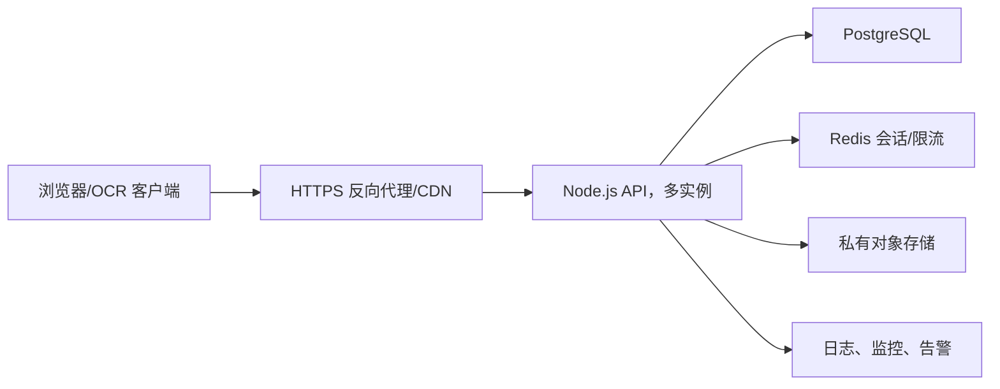

# 运行与部署

## 本地运行

最简单方式是双击 `TutorPlatform/start.bat`，或在仓库根目录执行：

```powershell
npm start
```

本机访问：<http://localhost:8787>。

## 临时公网演示

`TutorPlatform/auto-start.ps1` 可以：

1. 检查并启动 8787 端口的 Node 服务。
2. 启动 Cloudflare Quick Tunnel。
3. 从日志提取变化的 `trycloudflare.com` 地址。
4. 更新本机地址文本、网站跳转页和 `address-page/latest-url.json`。
5. 调用 Wrangler 部署固定地址发布页。

这个脚本写死了常见的 Node、cloudflared 和 npx 安装路径，其他电脑可能需要修改。Quick Tunnel 地址和电脑开机状态都不稳定，只适合演示。

临时演示前至少要：

- 关闭 `SMS_DEV_MODE`。
- 设置高强度管理员密码。
- 确认仓库和公网目录没有数据库备份、OCR 截图或日志。
- 了解当前自动注册、缺少限流和原图权限的风险。

## 推荐生产架构

当前 JSON 版本不建议直接扩大公网用户量。推荐目标：



OCR 助手仍在 Windows 用户电脑运行，只需把“网站地址”改为正式 HTTPS 域名。

## 生产上线前必须完成

1. 将 `db.json` 迁移到 PostgreSQL/MySQL，使用事务、唯一约束和迁移版本。
2. 将订单原图放入私有对象存储，按权限生成短时访问链接。
3. 使用 Redis/数据库保存会话、验证码和 OAuth state，支持重启和多实例。
4. 把高德、短信、微信和数据库凭据放入云密钥管理或受保护环境变量。
5. 增加登录/短信/反馈/API 限流、审计日志和异常监控。
6. 限制 CORS、增加安全响应头、HTTPS、请求超时和反向代理上传限制。
7. 明确注册、账号找回、原图查看、数据删除和管理员权限流程。
8. 做数据库与图片备份，验证恢复过程。
9. 完成域名备案/服务器区域选择、隐私政策、用户授权和个人信息保护评审。

## 环境变量

完整模板见 `.env.example`。服务不会自动读取 `.env`，生产平台应直接注入：

- `PORT`
- `TENCENT_SMS_SECRET_ID`
- `TENCENT_SMS_SECRET_KEY`
- `TENCENT_SMS_APP_ID`
- `TENCENT_SMS_SIGN_NAME`
- `TENCENT_SMS_TEMPLATE_ID`
- `TENCENT_SMS_REGION`
- `TENCENT_SMS_TEMPLATE_PARAMS`
- `WECHAT_OPEN_APP_ID`
- `WECHAT_OPEN_APP_SECRET`
- `WECHAT_REDIRECT_URI`

`WECHAT_REDIRECT_URI` 必须与微信开放平台后台允许的回调域名和路径一致，指向 `/api/auth/wechat/callback`。

高德 Key 当前从管理端写入数据库，而不是环境变量。迁移生产架构时建议改成服务端 Secret，并为 Web 服务 Key 配额和调用来源设置限制。

## 单机服务示例

在完成数据库改造前，只能按单实例运行。最低限度可使用进程管理器保持 Node 进程，并由 Nginx/Caddy 提供 HTTPS。运行用户必须对 `TutorPlatform/data/` 有读写权限。

不要把两个实例指向同一个 `db.json`，否则同步整文件写入可能互相覆盖或损坏数据。

## 数据备份

当前原型备份需要同时复制：

- `TutorPlatform/data/db.json`
- `TutorPlatform/data/source-images/`

备份包含手机号、密码散列、令牌散列和聊天截图，应加密、限制访问并定义删除期限。恢复时两者必须保持同一时间点，否则数据库会引用不存在的图片，或留下无引用图片。

## 固定地址发布页

`TutorPlatform/address-page/` 是独立静态页，读取同目录的 `latest-url.json`。正式域名上线后不再需要通过它跳转；应直接把域名解析到正式服务，避免多一次不稳定跳转。
