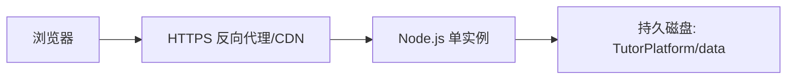

# 运行与部署

## 本地运行

```powershell
npm.cmd start
```

默认地址为 <http://localhost:8787>。

## 当前版本的公网部署要求

在数据库改造完成前，只能以单实例部署，且运行环境必须为 `TutorPlatform/data/` 提供持久可写磁盘。不要把两个实例指向同一个 `db.json`。

最低限度的部署结构：



启动命令为 `node TutorPlatform/server.js`，监听端口从平台注入的 `PORT` 环境变量读取。域名应直接解析到托管服务，并启用 HTTPS。

仓库根目录包含 `Dockerfile`，可使用支持持久磁盘的容器托管平台构建。镜像默认把数据目录设为 `/data`，持久磁盘应挂载到该路径；非容器环境也可用 `TUTOR_DATA_DIR` 指定数据目录。

## 环境变量

完整模板见 `.env.example`。服务不会自动读取 `.env`，生产平台应直接注入：

- `PORT`
- `AMAP_WEB_SERVICE_KEY`
- `AMAP_JS_API_KEY`
- `AMAP_JS_SECURITY_CODE`
- `TENCENT_SMS_SECRET_ID`
- `TENCENT_SMS_SECRET_KEY`
- `TENCENT_SMS_APP_ID`
- `TENCENT_SMS_SIGN_NAME`
- `TENCENT_SMS_TEMPLATE_ID`
- `TENCENT_SMS_REGION`
- `TENCENT_SMS_TEMPLATE_PARAMS`
- `WECHAT_OPEN_APP_ID`
- `WECHAT_OPEN_APP_SECRET`
- `WECHAT_REDIRECT_URI`

`WECHAT_REDIRECT_URI` 必须与微信开放平台后台允许的回调域名和路径一致，指向 `/api/auth/wechat/callback`。`SMS_DEV_MODE` 在公网环境中必须关闭。

`AMAP_WEB_SERVICE_KEY` 必须由部署平台作为 Secret/环境变量注入。不要写入管理页面、`db.json`、Wrangler 普通变量、日志、测试数据或 Git 历史。本地 PowerShell 可在启动进程前临时设置 `$env:AMAP_WEB_SERVICE_KEY`。

订单地图另用高德“Web端（JS API）”Key。`AMAP_JS_API_KEY` 必须绑定实际网站域名；`AMAP_JS_SECURITY_CODE` 必须作为服务端 Secret 注入并通过同源代理使用，禁止写入浏览器脚本。

## 备份

当前原型备份需要同时复制：

- `TutorPlatform/data/db.json`
- `TutorPlatform/data/source-images/`

备份可能包含手机号、密码散列、令牌散列和订单图片，应加密、限制访问并定义删除期限。

## 正式扩展前的改造

1. 将 `db.json` 迁移到 PostgreSQL/MySQL，使用事务、唯一约束和迁移版本。
2. 将订单图片放入私有对象存储，按权限生成短时访问链接。
3. 使用 Redis/数据库保存会话、验证码和 OAuth state。
4. 增加限流、审计、安全响应头、监控、备份和恢复演练。
5. 完成域名备案/服务器区域选择、隐私政策、用户授权和个人信息保护评审。
