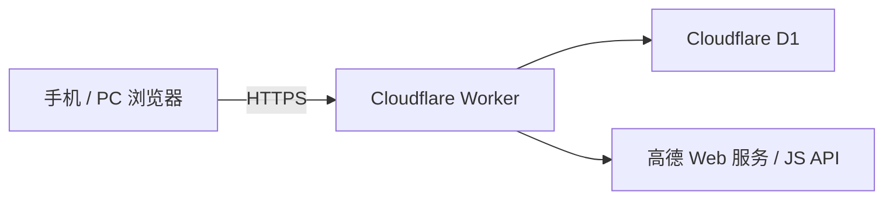

# 家教接单网站技术说明

## 1. 总体架构

正式站使用 Cloudflare Worker 同源提供静态页面、JSON API 和高德 JS API 代理，D1 保存业务数据：



本地开发使用 `TutorPlatform/server.js` 和被 Git 忽略的 `TutorPlatform/data/db.json`，其 HTTP 契约尽量与 Worker 保持一致。Node JSON 后端不是正式生产存储。

## 2. 技术栈

| 部分 | 技术 |
| --- | --- |
| 正式后端 | Cloudflare Worker，原生 JavaScript |
| 正式数据 | Cloudflare D1，版本化 SQL migration |
| 本地后端 | Node.js 20+，标准库 HTTP/FS/Crypto 与原生 `fetch` |
| 前端 | 原生 HTML、CSS、JavaScript，无打包器 |
| 地图 | 高德 Web 服务、JS API 2.0、同源安全代理 |
| 测试 | Node 合成回归、Worker 契约测试、真实浏览器验收 |

## 3. 代码结构

```text
.
├─ TutorPlatform/
│  ├─ server.js                  # 本地 Node API 与 JSON 开发存储
│  ├─ parser/                    # 唯一的切割、分类和字段解析逻辑
│  ├─ public/                    # 正式站与本地共用的网页前端
│  └─ data/                      # 本地运行数据，禁止提交
├─ cloudflare/
│  ├─ worker.js                  # 正式 API、权限、导入和定时任务
│  ├─ storage.js                 # D1 数据访问层
│  ├─ amap-service.js            # 高德 REST 服务、缓存和并发控制
│  └─ migrations/                # D1 结构迁移
├─ shared/                       # Node 与 Worker 共用业务契约
├─ docs/                         # 项目、API、数据和部署文档
├─ scripts/                      # 启动、部署辅助和密钥扫描
└─ tests/                        # 匿名合成回归与契约测试
```

## 4. 模块边界

- `TutorPlatform/parser` 独立维护切割、非订单分类和字段解析。UI、Worker 编排和地图不复制解析正则。
- `shared` 保存两种后端必须一致的去重、清洗、评分、异常判定和保留期规则。
- 前端只消费 HTTP 契约，不直接调用高德 Web Service，也不持有 Web Service Key 或 JS Security Code。
- `cloudflare/amap-service.js` 是正式服务端高德 REST 调用的唯一实现；订单导入、历史地点重试和路线入口复用它。
- `cloudflare/storage.js` 隔离 SQL 与业务编排。新增正式数据必须通过 migration 演进表结构。

## 5. 业务与身份边界

- 普通看单用户通过匿名浏览器设备身份打开即用，无登录门槛。
- 发单用户提交称呼和微信号/手机号后自动完成登记并获得导入权限；相同资料可跨浏览器恢复身份。
- 订单保留发单身份关联，但联系方式不出现在普通列表响应中，只在用户主动点击申请接单时按订单读取；该操作不创建接单申请记录。
- 管理员使用单独凭证与会话；真实 `AUTH_PEPPER` 仅存在 Worker Secret 或本地忽略文件。
- 页面偏好、已看订单和访客 ID 存在浏览器；正式订单、发单者登记、会话散列和统计存入 D1。

## 6. 订单识别与地点阶段

1. 前端把每次粘贴或 TXT 作为独立批次加入顺序队列。
2. `/api/parse` 调用共享解析器，返回 `parsed[]`、`splitDiagnostics[]` 和 `ignoredBlocks[]`；此阶段不调用高德。
3. `/api/import` 只读取短指纹列，并同时使用规范化原文指纹、核心字段语义指纹和旧兼容指纹过滤重复订单。
4. 仅新增且地点未确认的订单调用高德 POI，并保存标准地址、POI 和坐标。
5. 列表距离使用已保存坐标本地计算；地图和路线尽量复用坐标，避免重复地理编码。
6. 公共读取严格排除最近一次北京时间 6:00 以前的订单，正式定时任务随后物理清理。

## 7. 性能与稳定性

- 列表首屏不提前获取所有发单人联系方式，也不加载地图 SDK。
- 普通用户和发单者的 `/api/state` 使用精简 SQL 投影；只有管理员读取完整 `structured_json` 快照。
- 每日 6:00 换日条件直接下沉到 D1 查询，当日订单安全上限为 2000，不再在 500 条处截断。
- 地图实例在顶部视图切换间复用。
- 高德服务合并相同在途请求、使用短期缓存，并将 REST 并发限制为 4。
- 导入并发受控，重复订单在 POI 调用前过滤。
- 连续导入期间不反复拉取整份状态；队列空闲后统一刷新一次，自动重试复用原识别结果记录。
- 访客心跳仅在页面可见时按固定间隔更新，不增加页面访问量。
- 发单仅通过网页粘贴或 TXT 导入，不运行桌面桥接轮询和共享剪贴板队列。

## 8. 数据和安全

- `.env.local`、`.dev.vars`、`TutorPlatform/data/`、`dist/`、`build/` 和临时导出均不提交。
- 合成测试不得包含真实手机号、订单原文、家庭地址、截图、密码或地图密钥。
- D1 导出可能包含个人信息，必须加密、限权并定义删除期限。
- 非订单所有者的普通状态响应会裁剪精确坐标和联系资料。

## 9. 验证

```powershell
npm.cmd test
npm.cmd run cloudflare:test
npm.cmd run check:secrets
git diff --check
```

涉及界面时使用真实浏览器检查桌面和手机；涉及 D1 时先验证 migration，再应用远端；涉及正式行为时部署后检查 `https://tutor.liuzonghao.top`。

完整产品意图、交互细节和交接步骤见 [PROJECT_CONTEXT.md](./PROJECT_CONTEXT.md)。
