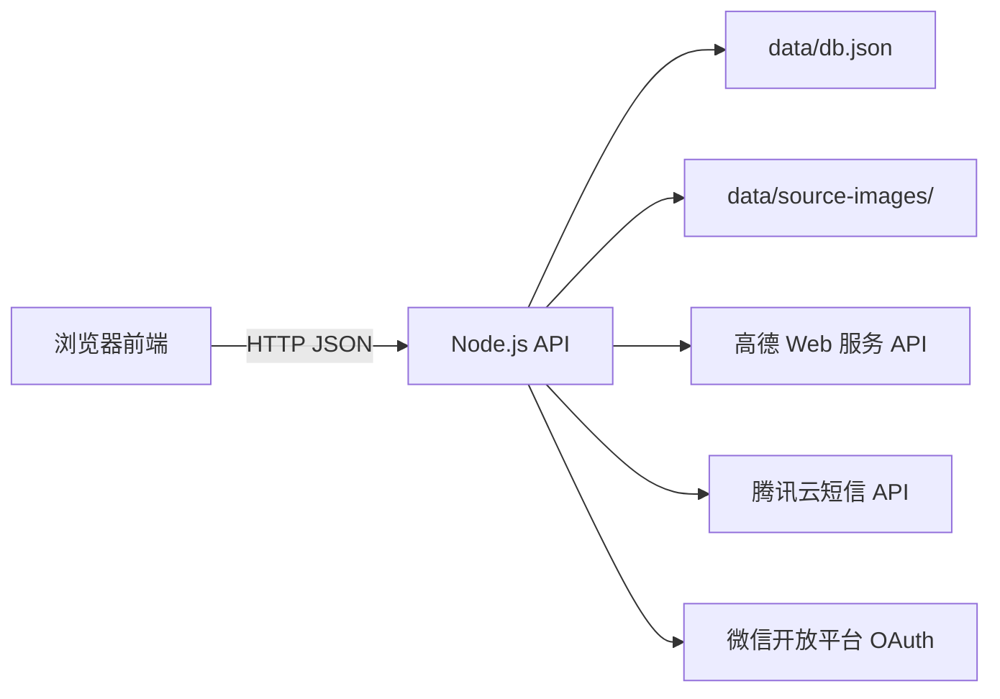

# 家教接单网站技术说明

## 1. 总体架构



网站当前是单进程原型：静态页面和 API 由同一个 Node.js 进程提供，数据保存在本地 JSON 文件和图片目录。

## 2. 技术栈

| 部分 | 技术 |
| --- | --- |
| 后端 | Node.js 20+，标准库 `http`、`fs`、`path`、`crypto` 和原生 `fetch` |
| 前端 | 原生 HTML、CSS、JavaScript，无打包器 |
| 数据 | `TutorPlatform/data/db.json` 和 `data/source-images/` |
| 密码 | `crypto.scryptSync` + 随机盐 |
| 短信 | 腾讯云 SMS HTTP API |
| 微信登录 | 微信开放平台网站应用 OAuth 2.0 |
| 地图 | 高德 Web 服务 POI、地理编码和路线规划 |
| 测试 | Node.js `node:assert` 合成烟雾测试 |

## 3. 代码结构

```text
.
├─ TutorPlatform/
│  ├─ server.js                  # HTTP 服务、权限、解析、地图和数据读写
│  ├─ parser/                    # 独立订单切割、识别契约、AI 与校验
│  ├─ start.bat                  # Windows 本地启动入口
│  ├─ public/                    # HTML、CSS 和浏览器 JavaScript
│  └─ data/                      # 运行数据，禁止提交
├─ docs/                         # API、数据模型和部署文档
├─ examples/                     # 匿名示例数据
├─ scripts/                      # 仓库密钥扫描
└─ tests/                        # 合成数据烟雾测试
```

## 4. 业务端

- 老师端：浏览、筛选和申请订单，保存筛选偏好，预览路线。
- 中介端：手工发单、粘贴多条文字批量解析、管理本人订单和申请者。
- 管理端：订单状态、账号、公告、反馈、密码重置和地点核验。

## 5. 认证与数据

- 普通 API 使用 Bearer Token，短期会话保存在进程内存。
- “记住登录”在 `HttpOnly`、`SameSite=Lax` Cookie 中保存随机令牌，数据库只保存散列。
- 管理端首次进入时设置至少 8 位密码。
- 高德 Web 服务 Key 优先从 `AMAP_WEB_SERVICE_KEY` 环境变量读取，本地也兼容管理端保存的 `db.json` 设置。生产环境应使用受保护的环境变量。

## 6. 已知生产风险

1. `db.json` 同步整文件写入，没有事务、文件锁或多进程并发保护。
2. 会话、验证码、OAuth state、访客计数和地图缓存在重启后丢失。
3. 密码登录可为不存在的身份自动注册，正式运营应分离注册和登录。
4. 登录、短信、反馈和 API 缺少生产级限流、审计日志和异常监控。
5. `SMS_DEV_MODE=1` 会把验证码返回浏览器，只能在本机开发环境使用。
6. 当前未完成数据自动备份、灾难恢复和隐私合规评审。

大规模上线前，应迁移到 PostgreSQL、Redis 和私有对象存储，并完成安全、备份、监控和合规改造。

## 7. 订单识别模块边界

订单识别由 `TutorPlatform/parser` 单独维护。`server.js` 的 `/api/parse` 只负责认证、读取请求和注入规则解析/高德核验依赖，不拥有切割或字段编排规则。解析服务统一返回 `parserVersion`、`parsed[]` 和 `splitDiagnostics[]`。

预览阶段不去重、不丢弃弱字段订单；只有用户确认导入后，导入流程才执行垃圾过滤和去重。这样可以保证切割错误在写库前可见、可纠正。
