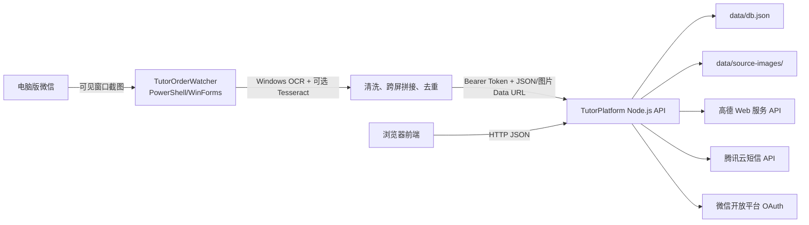

# 家教接单项目技术说明

本文以 2026-07-17 的实际代码为准，描述 `TutorPlatform` 网站和 `TutorOrderWatcher` Windows OCR 助手。仓库中的真实运行数据和私有回归素材已被排除，因此本文同时标出哪些能力只有代码实现、尚未经过生产环境验证。

## 1. 项目目标

系统解决两类流程：

1. 老师、中介和管理员通过网站发布、筛选、申请和管理家教订单。
2. 在没有个人微信合规消息 API 的情况下，通过 Windows 屏幕 OCR 把电脑版微信中当前可见的家教群消息整理并上传到网站。

OCR 助手不读取微信数据库、不注入微信进程，也不调用个人微信内部接口。它会激活微信窗口、搜索群聊、截取聊天正文、滚动历史消息并模拟必要的鼠标键盘操作。

## 2. 总体架构



网站是单进程、单文件数据存储的原型。静态页面和 API 由同一个 Node.js 进程提供；没有独立数据库、队列、对象存储或前端构建步骤。

## 3. 技术栈

| 部分 | 实际技术 |
| --- | --- |
| Web 后端 | Node.js 20+，内置 `http`、`fs`、`path`、`crypto`，原生 `fetch` |
| Web 前端 | 原生 HTML、CSS、JavaScript，无打包器和框架 |
| 数据 | 本地 JSON 文件和本地图片目录 |
| 密码 | `crypto.scryptSync` + 随机盐 |
| 短信 | 腾讯云 SMS HTTP API，代码内实现 TC3-HMAC-SHA256 签名 |
| 微信扫码 | 微信开放平台网站应用 OAuth 2.0 |
| 地图 | 高德 Web 服务：POI、地理编码、步行/骑行/驾车/公交路线 |
| Windows 助手 | Windows PowerShell 5.1、WinForms、UI Automation、`user32.dll` P/Invoke |
| OCR | Windows.Media.Ocr；可选 Tesseract 中文/英文补充识别 |
| 临时公网 | Cloudflare Quick Tunnel；固定发布页可部署到 Cloudflare Pages |
| 测试 | Node.js `node:assert`、PowerShell 脚本、私有 OCR 图片回归素材 |

## 4. 代码结构

```text
.
├─ TutorPlatform/
│  ├─ server.js                  # HTTP 服务、权限、解析、地图、数据读写
│  ├─ start.bat                  # Windows 本地启动入口
│  ├─ auto-start.ps1             # 本地服务、Quick Tunnel、发布页更新
│  ├─ public/
│  │  ├─ index.html              # 登录和三个业务端页面结构
│  │  ├─ app.js                  # 前端状态、接口调用、渲染和交互
│  │  ├─ styles.css              # 页面样式
│  │  └─ schedule-format.js      # 上课时间摘要规则，浏览器/Node 通用
│  ├─ address-page/index.html    # 固定地址发布页
│  └─ data/                      # 运行数据库和订单原图，永不提交
├─ TutorOrderWatcher/
│  ├─ TutorOrderWatcher.ps1      # 桌面 UI、微信自动化、OCR、上传
│  ├─ WindowsOcr.ps1             # Windows Runtime OCR 封装
│  ├─ 启动家教订单助手.bat       # PowerShell STA 启动入口
│  ├─ tessdata/                  # 可选 Tesseract 模型，本地下载
│  ├─ data/                      # 配置、截图、OCR、缓存、订单 CSV
│  ├─ temp/                      # 临时截图和增强图片
│  └─ exports/                   # 用户导出的 CSV
├─ docs/                         # 面向协作者的文档
├─ examples/                     # 匿名示例数据和配置
├─ scripts/                      # 仓库检查脚本
└─ tests/                        # 只允许合成数据的公开烟雾测试
```

两个模块原来各自的 `tests/` 目录包含从真实聊天得到的截图和 OCR 文本，因此不会上传。它们仍可在项目所有者本机用于私有回归。

## 5. 网站功能

### 5.1 登录和身份

- 默认登录页优先展示短信验证码，另有密码登录和微信扫码登录。
- 身份键是“名称 + 手机号”。统一登录会创建或找到一对 `teacher` 和 `agency` 用户记录，登录后可以切换老师端和发单端。
- OCR 助手使用兼容接口 `/api/login` 登录单独的中介角色。
- 普通会话 Token 只存在 Node.js 内存中，刷新页面时由 `sessionStorage` 保持，服务器重启后失效。
- “记住账号/自动登录”使用随机 `HttpOnly` Cookie；数据库仅保存该令牌的 SHA-256 散列。
- 管理端是独立的密码入口，没有管理员用户名。第一次设置至少 8 位密码。

### 5.2 老师接单端

- 浏览订单卡片、手动刷新订单。
- 多选深圳区域、K12 科目、年级段和教师性别。
- 最低课酬和仅看距离范围内订单。
- 选择步行、骑行、开车、公共交通模式，并输入起点获取地点建议。
- 筛选条件、起点和路线方式保存到老师账号；前端也保留本机缓存。
- 申请后立即看到发单人的名称和联系方式；中介能看到申请老师的名称、手机号和时间。
- 登录用户可查看订单关联的单张 OCR 原图。

### 5.3 中介发单端

- 手工填写并发布订单。
- 粘贴多条微信文字，先解析预览，再批量导入。
- OCR 助手可直接提交合并文字和图片页面。
- 相同中介按原文指纹、订单编号和近期语义指纹去重。
- 中介只能修改、关闭、重新开放或删除自己发布的订单。
- 查看自己订单的申请人数和申请老师联系方式。

### 5.4 管理端

- 查看与老师端近似的订单卡片。
- 修改订单状态、批量删除订单、批量删除账号。
- 删除中介账号时同时删除其订单和未引用原图；删除老师账号时清除申请记录。
- 重置普通用户密码。
- 发布或撤下公告，查看用户反馈。
- 保存默认地点、高德 Web 服务 Key 和默认距离参数。
- 对全部或指定订单重新执行高德地点核验。

### 5.5 统计口径

- 注册人数按普通用户的“名称 + 手机号”去重，不把老师/中介双记录重复计数。
- 在线人数不是 WebSocket 实时连接数，而是最近 5 分钟发过请求的浏览器访客 ID 数。

## 6. 订单解析和地点处理

核心逻辑集中在 `TutorPlatform/server.js`：

1. `sanitizeImportedText` 去除 OCR 噪声、微信未读提示和明显广告行。
2. `splitImportBlocks` 识别结构化字段、订单编号、连续短格式订单和多个课酬边界。
3. `dedupeImportBlocks` 优先保留字段更完整的重叠块。
4. `parseOrder` 提取区、地点、科目、年级、学生、时间、教师性别、要求和价格。
5. `looksLikeIncompleteStructuredImport` 暂缓跨屏截断且缺少关键字段的半条订单。
6. `resolveOrderLocation` 结合区名、地标规则、高德 POI 和地理编码核验真实地点。
7. `sourceImageForOrder` 用 OCR 文本 n-gram 相似度为每条订单选择最相关的一张原图。
8. `semanticOrderFingerprint` 对同一中介最近 7 天的开放订单做语义去重。

地点会保留原始值和解析值。候选冲突、跨区或匹配置信度不足时，订单标记为 `ambiguous`/“地点待核实”，路线不会伪装成精确结果。

## 7. OCR 助手流程

1. 进程启动时声明 Per-Monitor DPI aware，解决 200% 缩放下物理坐标偏移。
2. 找到可见的 `WeChat` 或 `Weixin` 主窗口，恢复并置前。
3. 根据微信窗口比例截取右侧聊天正文；也允许用户手工框选诊断。
4. 使用 Windows 中文 OCR，必要时调用 Tesseract 的普通、稀疏或增强图模式。
5. 清洗乱码并合并 Windows OCR/Tesseract 中高价值字段。
6. 自动模式用微信 UI Automation 搜索关键词，点击“查看全部”，按结果索引依次打开群聊。
7. 每个群向上滚动约半屏，保留重叠区域并读取配置的屏数。
8. `Merge-OcrPages` 合并重复行；同时生成相邻屏接缝图和完整纵向合成图。
9. 将合并文字、每屏 OCR 与图片 Data URL 提交 `/api/import`。
10. 网站拆单、去重、解析、地点核验，并只给每条订单保存一张匹配原图。

助手本地仍维护简化订单 CSV 和评分提醒，但网站导入才是主要数据链路。

## 8. 配置边界

### 网站环境变量

`PORT`、腾讯云 SMS 和微信开放平台变量见根目录 `.env.example`。代码不会自动读取 `.env` 文件；开发时需通过 PowerShell、进程管理器或部署平台注入。

### 网站数据库配置

高德 Key、管理员密码散列和默认位置目前保存在 `TutorPlatform/data/db.json`。该文件必须只存在于运行环境，不能进入仓库。

### OCR 配置

助手第一次保存后生成 `TutorOrderWatcher/data/config.json`。密码不写入该文件，但高德 Key、中介手机号、群关键词、截图坐标和网站地址会写入，因此整个目录都被忽略。字段示例见 `examples/TutorOrderWatcher-config.example.json`。

## 9. 已完成状态

交接时实际代码已包含：

- 三种普通用户登录方式的前后端代码，以及管理员登录。
- 老师/中介双端切换、账号筛选偏好、路线模式和地点候选。
- 订单申请双方联系方式、公告、反馈、批量管理和原图查看。
- 多格式文本拆单、语义去重、跨屏半单保护、地点核验和原图匹配。
- 200% DPI 截图范围、微信群搜索、自动滚屏、停止响应和 OCR 双引擎合并。
- 本机私有回归中曾验证 44 张历史原图均可读取，解析、跨屏、路线、原图和群名测试在交接前通过。

最后一项是交接时的本机测试记录，不等同于持续集成保证；私有素材没有进入仓库。

## 10. 已知问题和风险

1. `db.json` 同步整文件写入，没有事务、文件锁、迁移版本或多进程并发保护。
2. 普通会话、短信验证码、微信 OAuth state、在线访客和地图缓存都在内存中，重启会丢失。
3. 密码登录会为不存在的身份自动注册；正式运营应增加注册流程、验证码校验和风控。
4. 登录、管理员密码和匿名反馈缺少生产级 IP/账号限流、验证码、人机验证和审计日志。
5. `SMS_DEV_MODE=1` 会把验证码返回浏览器，只能在本机开发环境使用。
6. 任何已登录普通用户目前都能查看任意订单原图，应根据隐私策略进一步缩小权限或打码。
7. 地图 Key 仍存放在 JSON 数据库中，生产应改用密钥管理并限制高德配额和来源。
8. 前后端主要代码是单个大文件，测试和模块边界有限，后续修改容易产生回归。
9. OCR 自动化依赖微信窗口比例、控件树和文字清晰度；微信升级、多屏不同缩放或主题变化可能破坏定位。
10. 群搜索按 UI Automation 暴露的列表项和位置遍历，搜索结果虚拟化或同名群仍可能导致漏读/重复。
11. 视频消息、语音消息、图片内嵌订单和不可见历史消息没有完整自动识别实现。
12. 短信和微信扫码代码已存在，但仓库不含真实参数，也没有可复现的生产账号端到端验收记录。
13. 当前没有数据库自动备份、对象存储生命周期、错误监控、性能测试和灾难恢复演练。
14. 当前没有开源许可证，也没有完成个人信息保护、用户授权和数据留存的法律合规评审。

## 11. 后续开发建议

按风险和收益排序：

1. 将用户、订单、申请、公告、反馈和会话迁移到 PostgreSQL，并引入迁移工具和唯一约束。
2. 将原图迁移到私有对象存储，通过短时签名 URL 访问，并增加自动打码和保留期限。
3. 拆分 `server.js` 为认证、订单、解析、地图、存储模块；为 API 增加集成测试。
4. 把自动注册改为验证码注册，增加登录限流、操作审计、CSRF/CORS/安全响应头和权限测试。
5. 为 OCR 规则建立经过匿名化的公开基准集，记录准确率、拆单召回率、字段准确率和重复率。
6. 将 OCR GUI 的长操作移到后台 Runspace/Worker，UI 只处理状态和停止信号。
7. 增加微信群搜索结果快照、稳定群 ID 映射和每群读取游标，减少轮询重复。
8. 建立正式域名、HTTPS、监控、日志、备份恢复和灰度发布流程。

## 12. 尚不清楚的事项

- 没有独立产品需求文档，部分业务规则只存在于历史对话和代码中。
- 没有明确订单、用户、截图和反馈的法定/业务留存期限。
- 没有确认正式运营时所有用户是否都应同时拥有老师端和中介端权限。
- 没有确认订单原图对老师、中介和管理员各自应开放到什么范围。
- 没有确认生产短信签名、模板参数顺序和微信开放平台回调域名。
- 没有确认最终云服务商、数据库、对象存储和备案方案。

接手开发者在改变这些规则前，应先让项目所有者作出明确决定并记录到文档。
